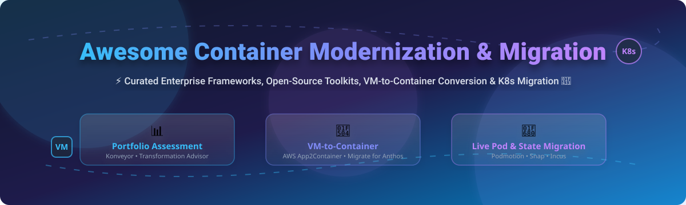

# Awesome-Container-Modernization-Migration-Tool

# Awesome-Container-Modernization-Migration-Tool 🐳 ⚡



  





  
  
  
  
  
  



---

## 🌟 Top Container Modernization & Migration Tool Ecosystem

**Curated List of Commercial Containerization Platforms & Open-Source Modernization Frameworks**  
*Focused on VM-to-Container Conversion, Application Portfolio Assessment, Code Refactoring, Kubernetes Migration & Self-Hosted Modernization Tools*

**Last updated: October 2026** 📅

---

### 📌 Overview & SEO Summary
Welcome to the ultimate curated directory of **container modernization and migration tools**, **open-source application assessment frameworks**, and **VM-to-container conversion platforms**. Whether you are looking for enterprise-grade commercial solutions (such as *AWS App2Container*, *Google Migrate for Anthos*, and *Tanzu App Transformer*), or self-hostable open-source alternatives (like *Konveyor*, *Jib*, and *OpsMind*), this list covers category leaders, code refactoring, and privacy-respecting application modernization.

**Key Market Context:**
- **Konveyor (CNCF Sandbox)** is the **leading open-source application modernization platform**, with **AI-powered code transformation (Kai)** and **IDE integration** for Java, .NET, Go, TypeScript, and Python .
- **AWS App2Container** provides **agentless containerization** for Java and .NET applications **without requiring source code** .
- **Google Migrate for Anthos** automates **VM-to-container conversion** by extracting critical application elements and inserting them into GKE containers .

---

## 📑 Table of Contents
- [🏢 SaaS & Commercial Platforms](#-saas--commercial-platforms)
- [🔓 Open-Source GitHub Projects](#-open-source-github-projects)
- [🛠️ How to Contribute](#%EF%B8%8F-how-to-contribute)
- [📊 Star History](#-star-history)
- [🤝 Support & Sponsorship](#-support--sponsorship)
- [⚠️ Disclaimer](#%EF%B8%8F-disclaimer)

---

## 🏢 SaaS & Commercial Platforms

The container modernization market spans **hyperscaler migration services** (AWS App2Container, Google Migrate for Anthos) that provide **VM-to-container conversion with deep cloud integration**, **enterprise modernization platforms** (Tanzu App Transformer, IBM Transformation Advisor) that offer **portfolio assessment and guided refactoring**, and **cloud migration platforms** (CloudEndure, Carbonite Migrate) that focus on **lift-and-shift VM replication**. **AWS App2Container** is **free** — you pay only for the underlying AWS resources consumed . **Google Migrate for Anthos** is **free** for the migration tooling, with GKE cluster costs applying. **VMware Tanzu App Transformer** uses **custom enterprise pricing**.

| SaaS / Commercial Platform | Company / Owner | Valuation / Market Cap | Standard Edition Starting Price | Free Tier / Free Trial Limits | Description |
| :--- | :--- | :--- | :--- | :--- | :--- |
| **[AWS App2Container](https://aws.amazon.com/app2container/)** ☁️ | Amazon | ~$2.0 Trillion | **Free tool**; pay only for AWS resources  | **Free forever** | **AWS-native containerization** — **Agentless discovery** of Java and .NET applications **without requiring source code** . **Generates Docker images, ECS task definitions, and Kubernetes pod definitions** . **Integrates with ECS, EKS, and App Runner** for deployment. **Supports Windows and Linux** servers. **No application source code required** — packages artifacts and dependencies. |
| **[Google Migrate for Anthos](https://cloud.google.com/migrate/anthos)** 🌐 | Google (Alphabet) | ~$2.0 Trillion | **Free migration tooling**; GKE cluster costs apply  | **$300 free credits** for new customers | **GCP-native VM-to-container migration** — **Automated extraction** of critical application elements from VMs and **insertion into containers on GKE** . **Merges migration and modernization in one step** — Lift & Shift happens behind the scenes . **Outputs Kubernetes YAML, Dockerfile, and Migration Plan** . **Reduces application costs by 20–40%** using tools and proven methodology . |
| **[Azure Migrate](https://azure.microsoft.com/en-us/products/azure-migrate/)** 🔷 | Microsoft | ~$3.90 Trillion | **Free service**; partner tools may charge  | **Free forever** (discovery, assessment, planning) | **Azure-native migration hub** — **Unified platform** for servers, databases, web apps, and virtual desktops . **Azure Copilot migration agent (preview)** provides conversational planning . **Container Apps migration guidance** for AWS Fargate to Azure Container Apps . |
| **[VMware Tanzu App Transformer](https://tanzu.vmware.com/)** 🏢 | Broadcom (VMware) | ~$60 Billion | **Custom enterprise pricing**  | **Demo available** | **Enterprise containerization platform** — **Automated analysis and containerization** of legacy applications. **Tanzu Kubernetes Grid** for deployment. **Integrates with VMware ecosystem** . |
| **[CloudEndure Migration](https://www.cloudendure.com/)** 🔄 | AWS (Acquired) | ~$2.0 Trillion | **Free for 90 days** per server  | **Free trial available** | **Live migration and disaster recovery** — **Block-level replication** for lift-and-shift migrations. **Minimal downtime** with continuous replication. **Supports physical, virtual, and cloud sources** . |
| **[Carbonite Migrate](https://www.carbonite.com/)** 📡 | OpenText (Carbonite) | ~$10 Billion (OpenText) | **Custom per-server pricing**  | **Free trial available** | **Live migration for any workload** — **Real-time byte-level replication**. **Minimal downtime migrations** between any infrastructure. **Automated failover and cutover** . |
| **[IBM Transformation Advisor](https://www.ibm.com/cloud/transformation-advisor)** 🏛️ | IBM | ~$200 Billion | **Custom enterprise pricing**  | **Free tier available** | **Application portfolio assessment** — **Identifies Java applications** for cloud migration . **Recommendations for containerization** and modernization pathways. **IBM Cloud Paks** for moving WebSphere, MQ, and other components to containers with minimal changes . |
| **[Portworx](https://portworx.com/)** 💾 | Pure Storage | ~$15 Billion | **Custom enterprise pricing**  | **Free tier available** | **Cloud-native storage for containers** — **Data mobility, backup, and migration** for stateful containerized applications . **Manages databases and stateful services** across any infrastructure. **Open-source tool with 226 GitHub stars** . |
| **[Turbonomic](https://www.ibm.com/products/turbonomic)** ⚙️ | IBM | ~$200 Billion | **$18.75/month** (Cloud tier)  | **30-day free trial**  | **Application resource management** — **Migration planning with Lift & Shift vs Optimized scenarios**. **What-if scenarios** for capacity planning and desired state modeling. **RI purchase recommendations** with break-even analysis . |
| **[Cast AI](https://cast.ai/)** 🎯 | Cast AI | Private | **Growth: $1,000/month**  | **Free (Monitoring): unlimited clusters** | **Kubernetes automation** — **Automated cluster autoscaling** with workload rightsizing. **Not a migration tool per se** — optimizes already-containerized workloads. **Includes a calculator** for cloud migration from hyperscalers . |

---

## 🔓 Open-Source GitHub Projects

*Sorted by GitHub_Stars_Count (Descending)* 🌟

- **[Konveyor](https://github.com/konveyor/operator)**   
  **Open-source application modernization platform**, Apache-2.0 licensed. **CNCF Sandbox project** — **the ultimate open-source toolkit** for safely migrating and modernizing application portfolios to Kubernetes and cloud-native technologies . **Application inventory and portfolio management** with business service linking and interdependency mapping . **Source code and binary analysis** for Java, .NET, Golang, TypeScript, and Python — **estimates migration effort** for different targets . **Extensible rulesets** with custom rules for your own frameworks — "if you encounter this, here is how you migrate" . **Konveyor AI (Kai)** uses **generative AI and RAG** to generate code suggestions for discovered migration issues — **model agnostic** with commercial model integration . **IDE plugin** (VS Code) and **CLI (kantra)** for developer workflows . **The most comprehensive open-source container modernization platform** . 🚀

- **[Jib](https://github.com/GoogleContainerTools/jib)**   
  **Build Java Docker and OCI images without a Docker daemon**, Apache-2.0 licensed. **14.1K GitHub stars** — **the Java developer's containerization tool** . **No Dockerfile required** — Maven and Gradle plugins build images directly from Java applications . **Daemonless** — build from within Maven or Gradle and push to any registry . **Fast and reproducible** — separates application into layers, only rebuilds changed layers . **Independent of cloud providers** — works with any container platform . **The simplest way to containerize Java applications** . ☕

- **[OpsMind](https://github.com/melonrind44345/opsmind)**   
  **Ansible-driven modernization assessment platform for legacy enterprise systems**, open-source. **Evaluates traditional enterprise systems for containerization readiness** and generates actionable migration artifacts . **Ansible-powered discovery** — automatic system fact collection via SSH or local . **Multi-dimension assessment**: Hardware Compatibility (30%), Software Support (30%), Configuration Complexity (20%), Security Baseline (20%) . **Professional reports** in Markdown, JSON, and HTML with methodology transparency . **Artifact generation** — Dockerfile, docker-compose, build scripts, and migration plans . **Intelligent fallback** — auto-degrades from Ansible → Native → Mock for demo and testing . **The most accessible open-source containerization assessment tool** . 🔍

- **[Snap](https://github.com/weaversoftio/Snap)**   
  **Container checkpointing and migration platform**, open-source. **Captures, saves, and restores running container states** — **seamless migration between OpenShift clusters** . **Live migration with state preservation** — legacy application containerization with state intact . **Disaster recovery** — instant application state backup and recovery with minimal RTO/RPO . **SnapAPI (FastAPI), SnapUI (React), SnapWatcher (operator), SnapHook (webhooks)** . **The most complete open-source container live-migration platform** . 📸

- **[Podmotion (Komodor)](https://github.com/komodor/podmotion)**   
  **Kubernetes pod live migration using CRIU**, open-source. **Migrates running containers between nodes without restarting** — **stateful application migration with in-memory state preservation** . **eBPF-based packet redirection** for zero-downtime migration . **Requires containerd 1.6+ and RuntimeClass** . **Supports Deployments, StatefulSets, DaemonSets, Jobs, and CronJobs** . **The most innovative open-source Kubernetes-native migration tool** . 🚀

- **[Boxer](https://github.com/dphilla/boxer)**   
  **Dockerfile to WebAssembly (Wasm) distribution converter**, open-source. **Reimagines cloud computing by transitioning from containers to Wasm-based "Boxes"** . **`box build -f Dockerfile`** converts existing containerized workloads into **near-universally deployable Wasm distributions** . **Reduced overhead, enhanced performance, superior security** — Wasm's memory-safe, isolated execution independent of the operating system . **Runs anywhere there is a WebAssembly runtime** — browsers, servers, embedded devices . **The most forward-looking open-source container modernization project** — the future of lightweight containerization . 📦

- **[Incus](https://github.com/lxc/incus)**   
  **Container hypervisor based on LXC**, Apache-2.0 licensed. **Provides REST API to remotely manage containers over the network** with **support for live migration** . **lxc-to-incus** migrates LXC containers to Incus . **lxd-to-incus** migrates existing LXD environments to Incus . **incus-migrate** is a **physical to container migration tool** . **The community fork of LXD** — the standard for system container migration . 🐧

- **[Dragonfly](https://github.com/dragonflyoss/dragonfly)**   
  **P2P-based image and file distribution system**, Apache-2.0 licensed. **CNCF Incubating project** — **peer-to-peer distribution for container images** . **Reduces registry bandwidth** by **up to 90%** . **Used by Alibaba, ByteDance, and other large-scale deployments** . 🐉

- **[Jib (Core)](https://github.com/GoogleContainerTools/jib)**   
  **The core Jib library for building OCI images**, Apache-2.0 licensed. **Used by the Maven and Gradle plugins** . **Java-native containerization without Docker** . ☕

- **[Podman](https://github.com/containers/podman)**   
  **Daemonless container engine**, Apache-2.0 licensed. **Podman generates Kubernetes YAML** — `podman generate kube` for migrating containers to Kubernetes . **Podman play kube** for running K8s YAML locally . **The migration bridge from Docker to Kubernetes** . 🦭

---

## 🛠️ How to Contribute

Contributions are welcome! Follow these steps to submit new container modernization platforms or open-source migration software:

1. 🍴 **Fork** the repository.
2. 📝 **Add/edit** entries in `README.md` maintaining table/list structure and formatting.
3. 🔗 Include project title, official website/GitHub link, exact Stars_Count, license, and brief description.
4. 🚀 Submit a **Pull Request** with a descriptive summary of your changes.

---

## 📊 Star History



---

## 🤝 Support & Sponsorship

If you find this container modernization and migration repository useful, please consider supporting the project:

- ⭐ **Star** this repository to increase visibility!
- 🔀 **Fork** and share with fellow DevOps engineers, platform teams, and open-source advocates.
- ☕ **Sponsor & Buy Me a Coffee**: Support ongoing open-source curation via the [GitHub Sponsor Dashboard](https://github.com/sponsors/ishandutta2007).

---

## ⚠️ Disclaimer

- This is a **community-curated** list — not exhaustive and not an endorsement. ℹ️
- **Konveyor is the leading open-source modernization platform** — **CNCF Sandbox**, with **AI-powered code transformation** and **IDE integration** for multiple languages . **AWS App2Container containerizes Java and .NET applications without source code** .
- **Google Migrate for Anthos merges migration and modernization** in a single step — Lift & Shift happens behind the scenes while outputting Kubernetes YAML and Dockerfiles . **Reduces application costs by 20–40%** .
- **Open-source tools (Konveyor, Jib, OpsMind) are not turnkey** — **Konveyor requires source code analysis and ruleset configuration** . **Jib requires Maven or Gradle** . **OpsMind requires Ansible or Python** . **Always validate modernization assessment with a proof-of-concept** before production migration. 🐳

---



  <b>Made with ❤️ for DevOps engineers, platform teams, and open-source modernization advocates.</b>

